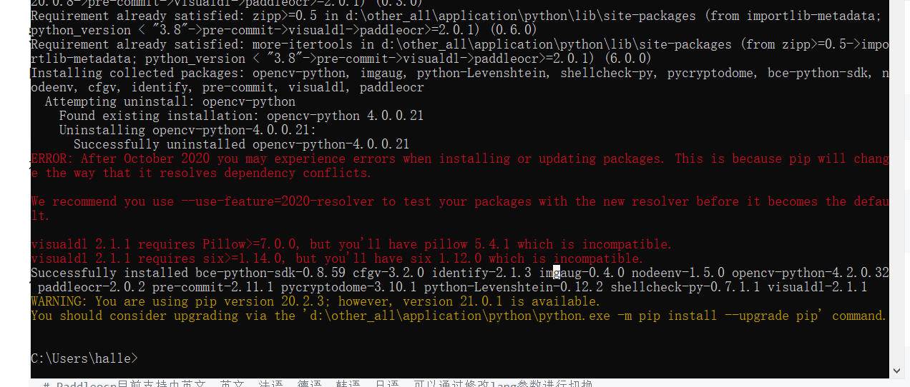

# Recognition_Brand_Vessel

## 我的环境

[如何查看cuda和cudnn版本](http://pianshen.com/article/24552024218)

Cuda10.0+VS2017 (Ver. 15.9.6)+cuDNN7.5.0+python3.6.7+win10

## 配置环境
[PaddleOCR的配置](https://github.com/PaddlePaddle/PaddleOCR/blob/release/2.0/doc/doc_ch/whl.md)

记录安装过程中的警告，以便今后复原

[PaddleOCR训练教程](https://github.com/PaddlePaddle/PaddleOCR/blob/release/2.0/doc/doc_ch/detection.md)

训练代码

python tools/train.py -c configs/det/det_mv3_db.yml -o Global.pretrain_weights=./pretrain_models/MobileNetV3_large_x0_5_pretrained/

断点续训代码

python tools/train.py -c configs/det/det_mv3_db.yml -o Global.checkpoints=output\db_mv3\latest Optimizer.base_lr=0.00001

评估

python tools/eval.py -c configs/det/det_mv3_db.yml  -o Global.pretrained_model="output/db_mv3/best_accuracy" PostProcess.box_thresh=0.5 PostProcess.unclip_ratio=1.5

测试代码

python tools/infer_det.py -c configs/det/det_mv3_db.yml -o Global.infer_img="D:\Other_All\Application_Documents\Medium\Lessons\ArticleForGraduation\Codes\data\detection\test\2550.jpg" Global.pretrained_model="./output/db_mv3/best_accuracy" Global.load_static_weights=false

测试所有测试图片

python tools/infer_det.py -c configs/det/det_mv3_db.yml -o Global.infer_img="D:\Other_All\Application_Documents\Medium\Lessons\ArticleForGraduation\Codes\data\detection\train" Global.pretrained_model="./output/db_mv3/best_accuracy" Global.load_static_weights=false

训练识别代码

python -m paddle.distributed.launch   tools/train.py -c configs/rec/rec_icdar15_train.yml

识别断点续训

 python -m paddle.distributed.launch  tools/train.py -c configs/rec/rec_icdar15_train.yml -o  Global.checkpoints=output\rec\ic15\latest

3000调多两个0

预测代码

python tools/infer_rec.py -c configs/rec/rec_icdar15_train.yml -o Global.pretrained_model=output/rec/ic15/latest Global.load_static_weights=false Global.infer_img="D:\Other_All\Application_Documents\Medium\Lessons\ArticleForGraduation\Codes\data\rec\test\2639.jpg"

## 创壹通航

 lscpu 
Architecture:        x86_64
CPU op-mode(s):      32-bit, 64-bit
Byte Order:          Little Endian
CPU(s):              48
On-line CPU(s) list: 0-47
Thread(s) per core:  1
Core(s) per socket:  24
Socket(s):           2
NUMA node(s):        2
Vendor ID:           GenuineIntel
CPU family:          6
Model:               85
Model name:          Intel(R) Xeon(R) Gold 6248R CPU @ 3.00GHz
Stepping:            7
CPU MHz:             1200.461
CPU max MHz:         4000.0000
CPU min MHz:         1200.0000
BogoMIPS:            6000.00
Virtualization:      VT-x
L1d cache:           32K
L1i cache:           32K
L2 cache:            1024K
L3 cache:            36608K
NUMA node0 CPU(s):   0-23
NUMA node1 CPU(s):   24-47
Flags:               fpu vme de pse tsc msr pae mce cx8 apic sep mtrr pge mca cmov pat pse36 clflush dts acpi mmx fxsr sse sse2 ss ht tm pbe syscall nx pdpe1gb rdtscp lm constant_tsc art arch_perfmon pebs bts rep_good nopl xtopology nonstop_tsc cpuid aperfmperf pni pclmulqdq dtes64 ds_cpl vmx smx est tm2 ssse3 sdbg fma cx16 xtpr pdcm pcid dca sse4_1 sse4_2 x2apic movbe popcnt tsc_deadline_timer aes xsave avx f16c rdrand lahf_lm abm 3dnowprefetch cpuid_fault epb cat_l3 cdp_l3 invpcid_single intel_ppin ssbd mba ibrs ibpb stibp ibrs_enhanced tpr_shadow vnmi flexpriority ept vpid ept_ad fsgsbase tsc_adjust bmi1 avx2 smep bmi2 erms invpcid cqm mpx rdt_a avx512f avx512dq rdseed adx smap clflushopt clwb intel_pt avx512cd avx512bw avx512vl xsaveopt xsavec xgetbv1 xsaves cqm_llc cqm_occup_llc cqm_mbm_total cqm_mbm_local dtherm ida arat pln pts pku ospke avx512_vnni md_clear flush_l1d arch_capabilities

Tue Apr 13 13:49:19 2021       
+-----------------------------------------------------------------------------+
| NVIDIA-SMI 440.33.01    Driver Version: 440.33.01    CUDA Version: 10.2     |
|-------------------------------+----------------------+----------------------+
| GPU  Name        Persistence-M| Bus-Id        Disp.A | Volatile Uncorr. ECC |
| Fan  Temp  Perf  Pwr:Usage/Cap|         Memory-Usage | GPU-Util  Compute M. |
|===============================+======================+======================|
|   0  Tesla V100-SXM2...  On   | 00000000:1B:00.0 Off |                    0 |
| N/A   36C    P0    40W / 300W |      0MiB / 32510MiB |      0%      Default |
+-------------------------------+----------------------+----------------------+
|   1  Tesla V100-SXM2...  On   | 00000000:1C:00.0 Off |                    0 |
| N/A   35C    P0    41W / 300W |      0MiB / 32510MiB |      0%      Default |
+-------------------------------+----------------------+----------------------+
|   2  Tesla V100-SXM2...  On   | 00000000:60:00.0 Off |                    0 |
| N/A   36C    P0    42W / 300W |      0MiB / 32510MiB |      0%      Default |
+-------------------------------+----------------------+----------------------+
|   3  Tesla V100-SXM2...  On   | 00000000:62:00.0 Off |                    0 |
| N/A   35C    P0    40W / 300W |      0MiB / 32510MiB |      0%      Default |
+-------------------------------+----------------------+----------------------+
|   4  Tesla V100-SXM2...  On   | 00000000:B1:00.0 Off |                    0 |
| N/A   34C    P0    40W / 300W |      0MiB / 32510MiB |      0%      Default |
+-------------------------------+----------------------+----------------------+
|   5  Tesla V100-SXM2...  On   | 00000000:B2:00.0 Off |                    0 |
| N/A   36C    P0    41W / 300W |      0MiB / 32510MiB |      0%      Default |
+-------------------------------+----------------------+----------------------+
|   6  Tesla V100-SXM2...  On   | 00000000:DA:00.0 Off |                    0 |
| N/A   35C    P0    40W / 300W |      0MiB / 32510MiB |      0%      Default |
+-------------------------------+----------------------+----------------------+
|   7  Tesla V100-SXM2...  On   | 00000000:DC:00.0 Off |                    0 |
| N/A   37C    P0    42W / 300W |      0MiB / 32510MiB |      0%      Default |
+-------------------------------+----------------------+----------------------+
                                                                               
+-----------------------------------------------------------------------------+
| Processes:                                                       GPU Memory |
|  GPU       PID   Type   Process name                             Usage      |
|=============================================================================|
